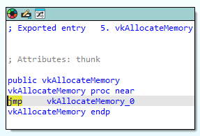
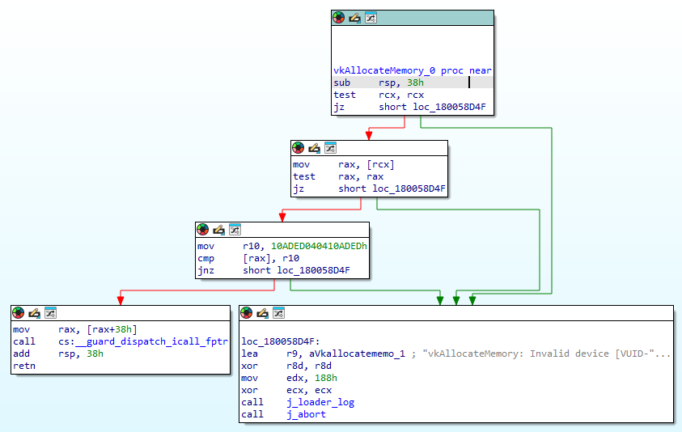
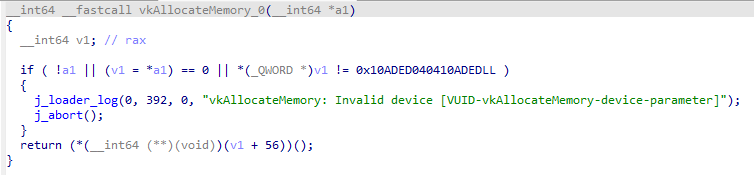
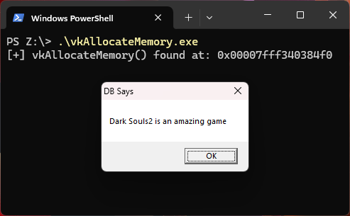

# vkAllocateMemory

[](https://www.buymeacoffee.com/whokilleddb)

This module uses `vkAllocateMemory()` function from `vulkan-1.dll`. The `vkAllocateMemory()` function just serves as a trampoline to the unexported `vkAllocateMemory_0()` function. 

> Note: This method also works with the `vkAllocateMemory` function exported by `C:\Windows\System32\Microsoft-Edge-WebView\vulkan-1.dll` but doesn't work with the one exported by `C:\Windows\System32\Microsoft-Edge-WebView\vk_swiftshader.dll`.

Looking at the function in IDA we see the following disassembly:

For `vkAllocateMemory()`:



And for `vkAllocateMemory_0()`:



The first thing I noticed was the string:

```
vkAllocateMemory: Invalid device [VUID-vkAllocateMemory-device-parameter]
```

Using [grep.app](https://grep.app/) and searching for this string, we come across the [following code](https://github.com/KhronosGroup/Vulkan-Loader/blob/main/loader/trampoline.c) which has a definition of `vkAllocateMemory()` as:

```c
LOADER_EXPORT VKAPI_ATTR VkResult VKAPI_CALL vkAllocateMemory(VkDevice device, const VkMemoryAllocateInfo *pAllocateInfo,
                                                              const VkAllocationCallbacks *pAllocator, VkDeviceMemory *pMemory) {
    const VkLayerDispatchTable *disp = loader_get_dispatch(device);
    if (NULL == disp) {
        loader_log(NULL, VULKAN_LOADER_FATAL_ERROR_BIT | VULKAN_LOADER_ERROR_BIT | VULKAN_LOADER_VALIDATION_BIT, 0,
                   "vkAllocateMemory: Invalid device [VUID-vkAllocateMemory-device-parameter]");
        abort(); /* Intentionally fail so user can correct issue. */
    }

    return disp->AllocateMemory(device, pAllocateInfo, pAllocator, pMemory);
}
```

This loosely checks out with the IDA disassembly(which is not very reliable at times but gives us a fair idea about what is happening):



So here is a rough idea of what _I think_ is happening.

- The function accepts a struct pointer (thanks to [@_winterknife_](https://x.com/_winterknife_) for the insight)
- It checks if the first element of that struct contains some sort of a signature (`0x10ADED040410ADED`)
- If the check fails, it terminates the program with an error message
- If the check succeeds, it invokes the member at the `0x38` offset in the struct and returns it's value


So, if we are able to create a struct which has a valid signature and a valid function pointer at the `0x38` offset and pass it to `vkAllocateMemory()`, we should be able to execute the function pointed to by the function. With this knowledge, we create the following PoC:

```c
EG_STR ex = { 0 };

ex.v1 = (DWORD64) &(ex.v2);
ex.v2 = CHECKSUM;
ex.v3 = 0x4343434343434343;
ex.v4 = 0x4444444444444444;
ex.v5 = 0x4545454545454545;
ex.v6 = 0x4646464646464646;
ex.v7 = 0x4747474747474747;
ex.v8 = 0x4848484848484848;
ex.v9 = (DWORD64)super_evil_function;

vkAllocateMemory(&ex);
```

We need to have a struct with the following nature:

- The second element contains the checksum/signature which is compared in the function in this stub:
```
mov r10, CHECKSUM
cmp [rax], r10
```
- the first element contains the _adress where the checksum is stored_. This is because if you look at the IDA graph, the `cmp` statement checks `[rax]` with `r10`, not `rax` with `r10`. Since the checksum value is stored in the second element of the struct, we store that value in the first element.
- Then, looking at the disassembly, we see that there is a `mov rax, [rax + 0x38]` before `jmp`-ing to the address store in `rax`, so we need to put our function pointer at an offset of `7*sizeof(DWORD64) = 56(0x38)` from the beginning of the struct. 
- Since the second entry(`v2`) contains the checksum, we essentially need to fill the rest of the elements from `v3` to `v8` with dummy data and finally storing the address of the function we wanna call in `v9`.

With everything in place, we should be able to call `vkAllocateMemory()` with this struct and it should call our `super_evil_function()`.

We compile and run our program and:



**IT WORKS!**


----
